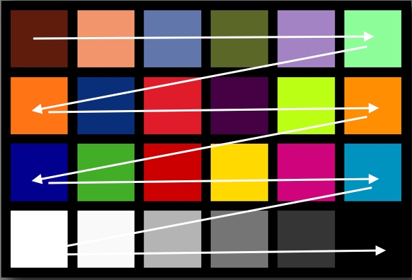
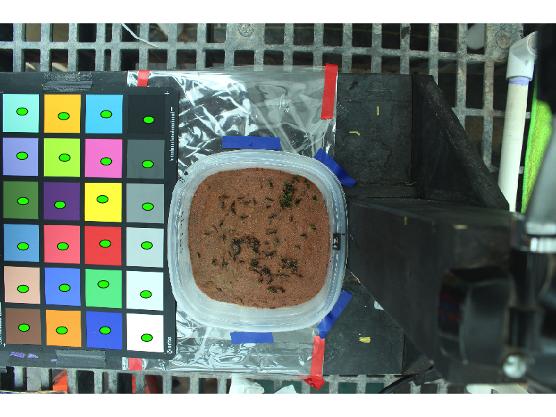
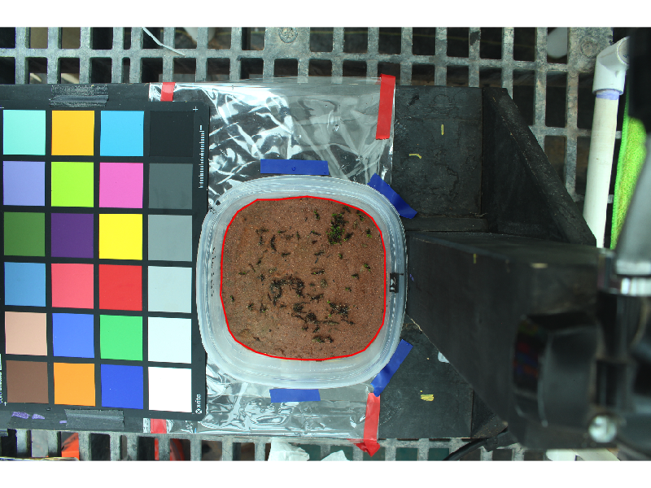
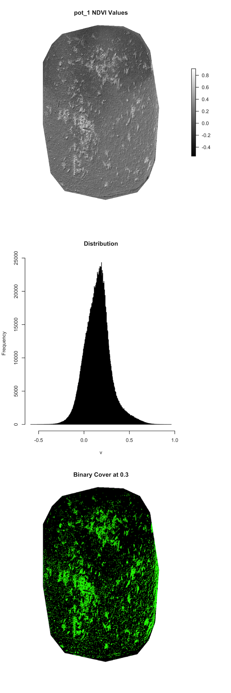
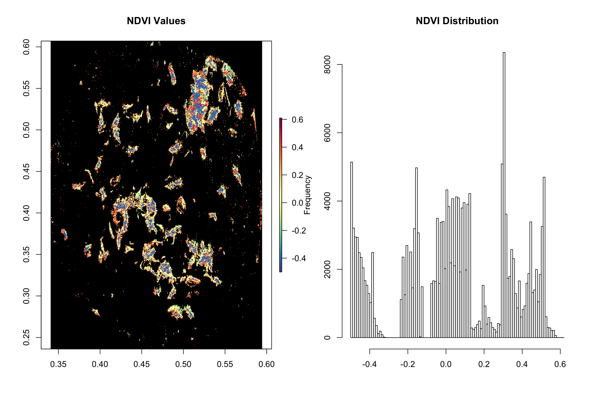
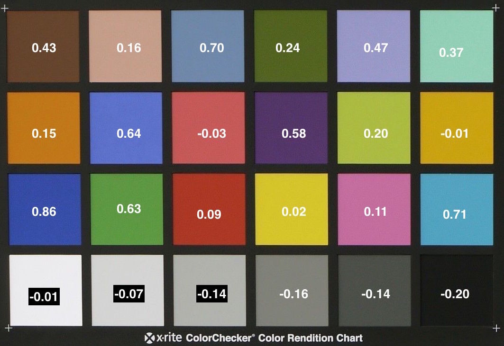
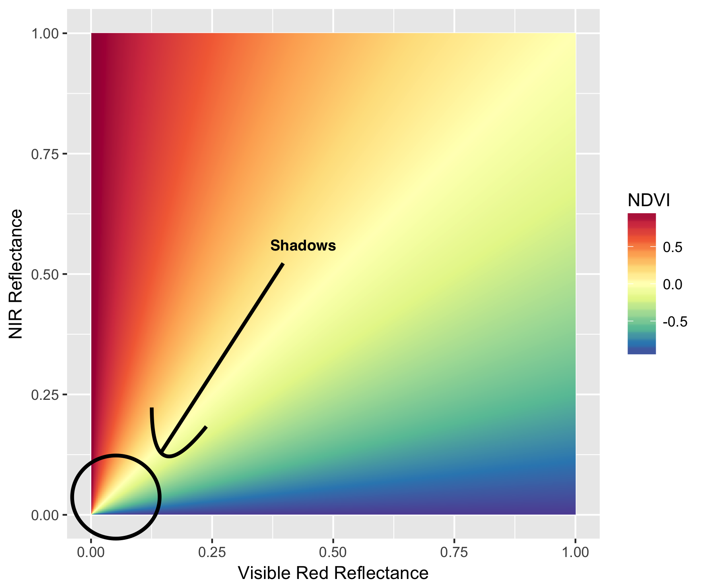

# Background

This package was developed as a tool to quantify biocrust activity, development, and cover from ground-based photo data. We implement the methods of Fischer et al. (2012) in which reflectance values of the visible red (VIS) and near-infrared bands (NIR) are estimated from decomposed color channels of a visible light camera. The method entails taking two images, one unfiltered and one with an infrared filter installed over the camera lens, of a scene containing biocrust and a color checker chart of known reflectance values. With these photo data they modeled reflectance as a function of camera pixel brightness, using the color checker cells as training data. From these modeled reflectance values they calculated NDVI of biocrust. While Fischer et al. employed reflectance values in visible red (600-700nm) and near-infrared (800-900nm) bands, earlier works report color checker reflectance values of blue (400-500nm) and green (500-600nm) bands (Ritchie et al. 2008). We extend this approach, modeling  the visible red, blue, green, and NIR reflectances as a function of pixel values, to calculate a suite of seven vegetation and biocrust indices:  

**Normalized Differential Vegetation Index - NDVI**

An ERTS-era remote sensing index that is correlated with chlorophyll content, commonly associated with "greenness" (Rouse et al. 1974). Scaled -1 to 1. 

 (NIR - RED) / (NIR + RED)  
 
***  

**Simple Ratio  - SR**

An un-normalized version of the above index. Unscaled.  

  (NIR) / (RED)  
  
***  

**Second Modified Soil Adjusted Vegetation Index - MSAVI2**

This index attempts to account for soil reflectances in scenes containing high levels of bare soil (Qi et al. 1994) Scaled -1 to 1.

  (2 x NIR + 1 - sqrt((2 x NIR + 1)<sup>2</sup> - 8 x (NIR - RED))) / 2  
  
***  

**Enhanced Vegetation Index - EVI**

A vegetation index that correlates more strongly with canopy structure and leaf-area index (Huete et al. 1999). Scale varies, though commonly between -1 and 1. 

  2.5 x ((NIR - RED) / (NIR + 6 x RED - 7.5 x BLUE + 1))  
  
***  

**Crust Index - CI**

An index quantifying cyanobacteria development (Karnielli 1997). Values range from 0 to 2. 

  1 - (RED - BLUE) / (RED + BLUE)  
  
***  

**Biological Soil Crust Index - BSCI**

An index for quantifying lichen development (Chen et al. 2005). Values appear positive with no upper limit. 

  (1 - 2 x |RED - GREEN|) / mean(GREEN, RED, NIR)  
  
***  

**Brightness Index - BI**

A value inversely related to dark biocrust development (Escadafal & Bacha 1996). Values range from 0 to slightly less than 2. 

  sqrt(GREEN<sup>2</sup> + RED<sup>2</sup> + NIR<sup>2</sup>)  
  
***  

## Installation
Users may download and install the crustCover package from the Github repository as demonstrated below:

```{r, eval=F}
if (!require("devtools"))
  install.packages("devtools")
  library(devtools)

install_github(repo = "mosscoder/crustCover")
```

## Preparing the Working Directory

The functions in the crustCover package expect the following folders and optional file in the working directory:

|**Mandatory Folders**  |
|-----|
|vis|
|nir  |
***

|**Optional Files**  |
|-----|
|names.csv  |
***

<i>Note that the above are case sensitive</i>. 

The user should have a set of two files for each biocrust observation: a VIS image and NIR image. Place all of the visible light images in the **vis** folder and all of their NIR images in the **nir** folder of the working directory. crustCover functions can only process jpeg files at this time. 

The crustCover functions expect that these photos are in sequence, i.e.:

- **observation 1 VIS:** IMG_100.jpeg 
- **observation 1 NIR:** IMG_101.jpeg
- **observation 2 VIS:** IMG_102.jpeg
- **observation 2 NIR:** IMG_103.jpeg

The functions can tolerate breaks in the sequence (jumping from 100 to 103, for example). The functions will ignore non-numeric characters in the file name, and sort only by numerals. 

The crustCover functions will automatically name the output files obs_1, obs_2, obs_3, etc., but the user may optionally specify a list of names to label the function output files by adding a .csv titled **names.csv** to the working directory. There should be one name per observation in the following format:

|**names**|
|-----|
|alternate id 1|
|alternate id 2|
|alternate id 3|


## Establishing Color Checker Cells Positions

To establish the positions of the color checker cells, create an object from the chart() function.

```{r, eval=F}
chart <- chart()
```

A template image will be loaded, and the user must click on all 24 cells of the color chart in order to establish the positions of each:     

  

***

The chart() function will then display the cell positions as specified by the user. Call the function again if the positions appear incorrect. <i>Avoiding shadows and damaged or discolored regions of the color checker cells is critical for accurate reflectance predictions.</i>



If you find that the default sampling regions (green dots) for the cells are too large, you may adjust the radius of the regions with the samp.width argument (0.01 by default):
```{r, eval = F}
chart <- chart(samp.width = 0.001)
````


## Defining the Observation Area

To establish the observation area, create an object with the drawObs() function:
```{r, eval=F}
obs.area <- drawObs()
```
The function will load a template image in which the user may click any number of times to circumscribe the observation area. After defining the bounds of the observation area, press the escape key and the function will extract the coordinates of the pixels in the image. Note that this may take several seconds, depending on the image resolution and dimensions of the observation area.   



## Calculate Spectral Indices

The user may now calculate spectral indices of their images via batch processing:

```{r, eval=F}
ccSpectral(chart = chart, obs.area = obs.area)
```

The function assumes that the color checker and observation areas are the same across all photos in the data set. Unique reflectance models for all bands are trained from the color checker values in each image to address any differences in lighting conditions.  

## Apply Index Thresholds to Calculate Cover 
A list of thresholds for each of the spectral indices establishes the cutoff points for distinguishing biocrust from other cover types. Fischer et al. found that moderately developed biocrust had median NDVI values ranging from 0.25 to 0.55 or more on sandy soils of high reflectance. By default all thresholds are set at 0.3, **but users must tailor these cutoffs to their own dataset to get useful measures of cover**. Users may adjust the threshold values with the threshold argument as follows:

```{r, eval=F}
ccSpectral(chart = chart, obs.area = obs.area, threshold = c(0.3, 0.3, 0.3, 0.3, 0.3, 0.3, 0.3 ))
```

Note that you must provide thresholds for all seven indices (0.3 by default), in the following order:  
c(**ndvi**, **sr**, **msavi**, **evi**, **ci**, **bsci**, **bi** )

We advise evaluating only a few sets of images initially to estimate appropriate threshold values. For all values except bi, the threshold will calculate percent of pixels above the supplied thresholds. 

## Option to Apply Machine Learning to Predict Reflectance
Fischer et al. modeled the relationship between pixel brightness and reflectance with an exponential function, which we have found to perform well for the visible light bands. We have found the fit for the NIR band, however, is sometimes inadequate when modeled with an exponential function. The relationship between pixel brightness and reflectance for NIR often appears sigmoid in our data. To address this, we provide the option of modeling reflectance with machine learning algorithms.  

We construct a multi-response random forest, predicting red, green, blue, and NIR bands as a function of the three color channels of the visible light image only (Breiman 2001, randomForestSRC package). This approach is unpublished, but we have found that r-squared values often exceed 0.99 (out of bag estimates) for all modeled reflectances. This approach obviates the need for an IR filter, and thus eliminates potential noise derived from installation of the filter, such as changes in camera position. It comes at a computational cost, ~25% increase in processing time per photo.

To implement machine learning, set the ml argument to TRUE. When ml is TRUE, if the exponential models fall below an r-squared cutoff (default 0.9) the ccSpectral() function will use reflectance predictions from the random forest model to calculate indices. 

```{r, eval=F}
ccSpectral(chart = chart, obs.area = obs.area, ml = T)
```

To adjust the r-squared cutoff, pass the desired value to the ml.cutoff argument.

```{r, eval=F}
ccSpectral(chart = chart, obs.area = obs.area, ml = T, ml.cutoff = 0.95)
```

If you would like to use the random forest predictions for all bands, set the ml.cutoff to 1. 

## Option to Produce Rasters of Indices and Binary Thresholds
If you would like to save raster images for additional processing, set the rasters argument to TRUE.

```{r, eval=F}
ccSpectral(chart = chart, obs.area = obs.area, rasters = T)
```

The ccSpectral() function will then add two file types for each of your observations to your output folder:  

1) A raster stack "obs_x_spectral_stack.tif" containing seven layers corresponding to each of the index values, multiplied by 1000 to avoid floating point values and reduce file size.    

2) A raster stack "obs_x_cover_stack.tif" containing seven layers corresponding to binary thresholds set by the thresholds argument for each spectral index.  

The layers of each stack are ordered:  
**ndvi**, **sr**, **msavi**, **evi**, **ci**, **bsci**, **bi**   

The resulting file sizes can be quite large, more than 10 megs per spectral stack. 

## Output 

Following processing, the ccSpectral() function will create a new folder in you working directory labeled "output date time". In this folder you will find the "summary_data.csv", which provides the following information for each observation:  

- Observation ID  
- VIS filename  
- NIR filename  
- R-squared values for all band models
- Median value within the observation area for all indices
- Mean value within the observation area  for all indices 
- Binary threshold value applied to each index 
- Percent cover within the observation area at binary threshold for all indices 

***  

ccSpectral() will also produce a "obs_x.pdf" file for each observation containing:  

- A histogram of values within the observation area for all indices  
- A plot of values within the observation area for all indices  
- A binary plot of depicting all pixels above the threshold for all indices



As noted earlier, if you set the rasters argument to TRUE, then the underlying values from the above plots will be saved to your working directory as .tif raster stacks.

## An Example Workflow
Here we provide an example of how indices may be used together to get an estimate of biocrust activity. In evaluating the outputs from the BSCI image, we find that a threshold of 5 corresponds to our biocrust taxa of interest. In the following workflow we will remove pixels in the NDVI layer below our BSCI threshold. 

```{r, eval=F}
library(crustCover)

chart <- chart()
obs.area <- drawObs()

#Set the BSC Index threshold to 5 to exclude uncrusted background soil
ccSpectral(chart = chart, obs.area = obs.area, 
           rasters = T, ml = T, thresholds = c(0.3, 0.3, 0.3, 0.3, 0.3, 5, 0.3))

#Load the processed spectral data, divide by 1000 to restore to original scale
spec.stack <- stack("./output 2017-05-09 10:36:16/obs_1_spectral_stack.tif")/1000

#Load the binary cutoff data
cover.stack <- stack("./output 2017-05-09 10:36:16/obs_1_cover_stack.tif")

#Select the NDVI layer from the spectral stack
obs1.ndvi <- spec.stack[[1]]

#Select the BSCI binary mask from the cover stack, and set uncrusted values as NA
obs1.bsci.bin <- cover.stack[[6]]
rcl <- cbind(0, NA)
obs1.bsci.mask <- reclassify(obs1.bsci.bin, rcl)

#Mask out NDVI values below the BSCI threshold
ndvi.crust <- mask(obs1.ndvi, obs1.bsci.mask)

#Plot the results
pal <- colorRampPalette(colors = rev(brewer.pal(11, "Spectral")))(100)

##png("workflow_example.png", width = 12, height = 8, res = 300, units = "in")
par(mfrow = c(1,2))
plot(ndvi.crust, col = pal, colNA = "black", main ="NDVI Values")
hist(ndvi.crust, breaks = 100, main ="NDVI Distribution", xlab = "")
##dev.off()
```


## NDVI and "Greenness"
While NDVI is often thought of as greenness, hues commonly perceived as green may vary greatly in NDVI values. Observe the corresponding  Xrite ColorChecker NDVI values calculated from spectrometer readings (Ritchie et al. 2008):


In the above image, note that cell 4 (top row, third from the right), cell 11 (second row, second from the right), and cell 14 (third row, second from the left) all correspond to green hues. Cells 4 and 11 have NDVI values 0.24 and 0.20, while cell 14 has a value of 0.63. Cell 4 and 11 hues we might associate with healthy tissues of certain biocrust moss species, such as <i>Syntrichia caninervis</i> or <i>Bryum argenteum</i>. Thus, estimated NDVI values of moss tissues may not differ greatly from that of background soil, or may be less than that of background soil.

##NDVI and Shadows
NDVI values are unstable in scenes containing shadows or uneven lighting gradients. Observe the following figure of NDVI space:

NDVI is high when NIR reflectance values are high and VIS values are low. However, when both NIR and VIS reflectances are low, small relative differences in either band can lead to drastic differences in NDVI. This region of NDVI space (low NIR and low VIS reflectance, lower left in the above figure) corresponds to shaded and dark images within a scene. Thus, practitioners must take great care to ensure even lighting conditions within their images to achieve reliable NDVI estimates. Additionally, dark substrates, or even dark cyanobacteria and lichen crusts, may have low reflectances in NIR and VIS bands, and practitioners should exercise caution when interpreting image processing outputs from these cover types. 

## A Note on Repeat Observations

Because camera and color checker position are critical to these processes, we strongly advise batch processing for each time point separately.

## Future Directions and Feedback
The crustCover package is a living entity, intermittently nurtured during the less demanding epochs of my PhD. I am interested in your ideas for improvements to the package, alerts to any bugs you might find, and invite you to collaborate in future works. Please feel free to contact me at: kyledaviddoherty@gmail.com. 

## References
Breiman, L. 2001. Random forests. Machine learning, 45(1):5-32.

Escadafal, R., Bacha, S. 1996. Strategy for the dynamic study of desertification. In: Proc. ISSS Int. Symp. Ouagadougou, Burkino Faso, pp. 19–34.

Fischer, T., M. Veste, A. Eisele, O. Bens, W. Spyra, and R. F. Hüttl. 2012. Small scale spatial heterogeneity of Normalized Difference Vegetation Indices (NDVIs) and hot spots of photosynthesis in biological soil crusts. Flora: Morphology, Distribution, Functional Ecology of Plants 207:159–167.

Huete, A., Justice, C., & Van Leeuwen, W. 1999. MODIS vegetation index (MOD13). Algorithm theoretical basis document, 3, 213.

Karnieli, A. 1997. Development and implementation of spectral crust index over dune sands. International Journal of Remote Sensing, 18(6):1207-1220.

Qi, J., Chehbouni, A., Huete, A. R., Kerr, Y. H., & Sorooshian, S. 1994. A modified soil adjusted vegetation index. Remote sensing of environment, 48(2):119-126.

Ritchie, G. L., Sullivan, D. G., Perry, C. D., Hook, J. E., & Bednarz, C. W. 2008. Preparation of a low-cost digital camera system for remote sensing. Applied engineering in agriculture, 24(6):885.

Rouse Jr, J., Haas, R. H., Schell, J. A., & Deering, D. W. 1974. Monitoring vegetation systems in the Great Plains with ERTS.
