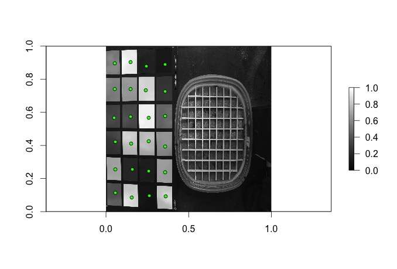
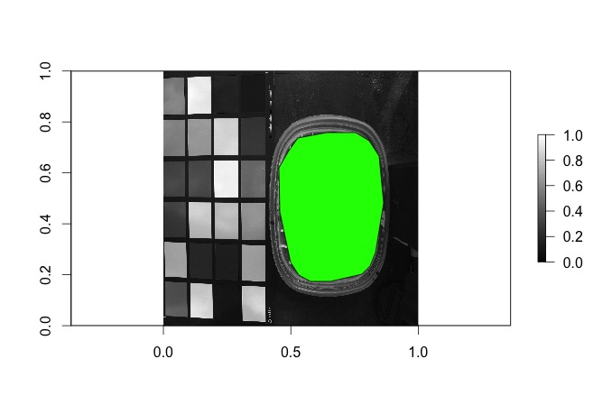

# Background

This R package was developed as a tool to quantify biocrust development and cover from photo data. The methods are an adaptation of Fischer et al. (2012) in which a point and shoot camera and filter were used to determine NDVI of biocrusts. They callibrated the reflectance of the visible red (VIS) and near-infrared bands (NIR) from the images with a color checker of known reflectance values. From these corrected reflectance data they then calculated NDVI.  

## Installation
Users may download and install the crustCover package from a Github repository as demonstrated below:

```{r, eval=F}
if (!require("devtools"))
  install.packages("devtools")
  library(devtools)

install_github(repo = "mosscoder/crustCover")
```

## Preparing Files and Establishing the Working Directory

The functions in the crustCover package expect the following folders and optional files in the working directory:

**Mandatory Folders**  
vis  
nir  
ndvi  

**Optional Files**  
names.csv  

Note that the above are case sensitive. 

The user should have a set of two files for each biocrust observation: a VIS image and NIR image. Place all of the visible light images in the **vis** folder and all of their NIR images in the **nir** folder of the working directory. crustCover functions can only process jpeg files at this time. 

The crustCover functions expect that these photos are in sequence, i.e.:

- **observation 1 VIS:** IMG_100.jpeg 
- **observation 1 NIR:** IMG_101.jpeg
- **observation 2 VIS:** IMG_102.jpeg
- **observation 2 NIR:** IMG_103.jpeg

The functions can tolerate breaks in the sequence (jumping from 100 to 103, for example). The functions will ignore non-numeric characters in the filename, and sort only by numerals. 

The crustCover functions will automatically name the output files observation_1, observation_2, observation_3, etc., but the user may optionally specify a list of names to label the function output files by adding a .csv titled **names.csv**. There should be one name per observation in the following format:

|**names**|
|-----|
|pet name 1|
|pet name 2|
|pet name 3|


## Establishing Color Checker Cells for Callibration 

To establish the positions of the color checker sequares, call the following function and store it as an object:

```{r, eval=F}
library(crustCover)
chart <- chart()
```

A template image will be loaded, and the user must click on all 24 cells of the color chart in order to establish the coordinates of each:     

  

***

The chart() function will then display the chart positions as specified by the user. Call the function again if the positions appear incorrect.



## Establishing observation Area for Stats and Cover Calculations

To establish the observation area, call the following function and store it as an object:
```{r, eval=F}
pot <- pot()
```
The function will load a template image, and the user must click 16 times around the perimeter of the observation to establish the observation area. Call the function again to correct errors.  



## Image Processing

The user may now batch process their images to determine NDVI and other metrics:

```{r, eval=F}
ndvi(chart = chart, observation = observation)
```

An NDVI threshold establishes the cutoff point for distinguishing biocrust from other cover types. Fischer et al. found that moderately developed biocrust had median NDVI values ranging from 0.25 to 0.55 or more on sandy soils. By default the threshold is set at 0.3, but for darker substrates, or images with intense shadows, a higher threshold may be needed. Users may adjust the threshold value with the threshold argument as follows:

```{r, eval=F}
ndvi(chart = chart, observation = observation, threshold = 0.75)
```

We advise initially evaluating only one or two sets of images to estimate appropriate threshold values. 

To minimize noise from shadows, a pixel neighborhood averaging calculation is applied by default. This default value can be adjusted with the agg.fact argument (default 10).

```{r, eval=F}
ndvi(chart = chart, observation = observation, agg.fact = 1)
```

Lower values will yield higher resolution data, but with greater likelihood of associated noise from shadows. Performance also suffers when set to a smaller neighborhood. 

## Output from NDVI Calculations

Following processing, a file titled "ndvi.data.csv" is placed in the working directory. It contains median NDVI, mean NDVI, threshold value, and percent cover estimation for each observation.

Plots of NDVI, histograms, and binary presence/absence cover are place in the ndvi folder of the working directory for each observation. Additionally, .tif format rasters of NDVI and cover are placed in the ndvi folder. 


## A Note on Repeat Observations

Because camera and color checker position are critical to these processes, we strongly advise batch processing for each time point separately.


## References

Fischer, T., M. Veste, A. Eisele, O. Bens, W. Spyra, and R. F. Hüttl. 2012. Small scale spatial heterogeneity of Normalized Difference Vegetation Indices (NDVIs) and hot spots of photosynthesis in biological soil crusts. Flora: Morphology, Distribution, Functional Ecology of Plants 207:159–167.
